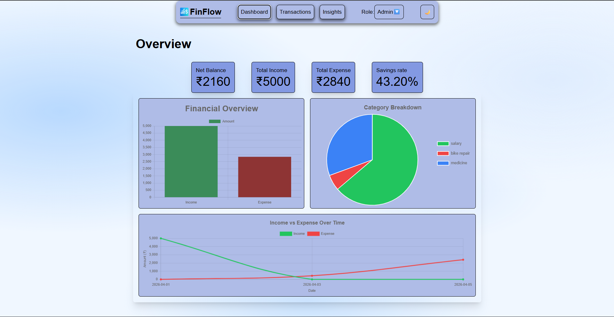
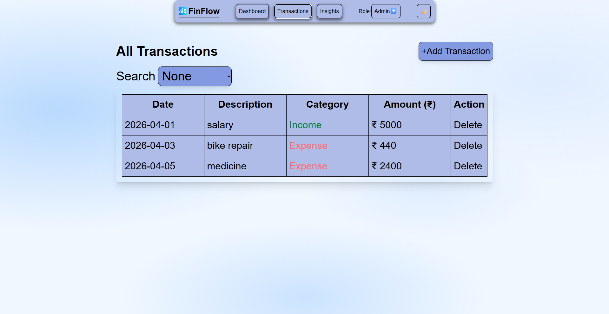

💰 FinFlow – Smart Expense Tracker

Take control of your finances with real-time insights that matter.  
Monitor income, track expenses, and understand your spending habits.  
All in a clean, intuitive dashboard built for simplicity.

🌐 Live

    https://finflow-topperguy.netlify.app/

🚀 Features

📊 Interactive Dashboard
<ul>
<li>View net balance, income, expenses, and savings rate</li>
<li>Visual charts (Bar, Pie, Line) for financial insights</li>
</ul>

💸 Transaction Management
<ul>
<li>Add, delete, and filter transactions</li>
<li>Search by date, category, description, or amount</li>
</ul>

🧠 Smart Insights
<ul>
<li>Detect spending trends</li>
<li>Identify top spending categories</li>
<li>Show savings/overspending alerts</li>
</ul>

🎨 Modern UI
<ul>
<li>Fully responsive design</li>
<li>Dark / Light mode toggle</li>
<li>Styled with Tailwind CSS</li>
</ul>

⚡ Other Highlights
<ul>
<li>Role-based access (Admin/User)</li>
<li>Local storage persistence</li>
<li>Smooth UI interactions</li>
</ul>

🛠️ Tech Stack
<ul>
<li>Frontend: React (Hooks + Context API)</li>
<li>Styling: Tailwind CSS</li>
<li>Charts: Chart.js + react-chartjs-2</li>
<li>State Management: Context API</li>
<li>Storage: LocalStorage</li>
</ul>

📂 Project Structure

    src/
    │── components/
    │   ├── Navbar.jsx
    │   ├── Hero.jsx
    │   ├── Dashboard.jsx
    │   ├── Transactions.jsx
    │   ├── Insights.jsx
    │
    │── context/
    │   ├── DataContext.jsx
    │   ├── UIContext.jsx
    │
    │── assets/
    │   ├── demo.mp4
    │   ├── logo.png
    │   │── Screenshots/
    │       │── Screenshot-1.png
    │       │── Screenshot-2.png
    │
    │── index.css
    │── App.jsx
    │── main.jsx

⚙️ Installation & Setup

Clone the repo

    git clone https://github.com/topperguy7/finflow.git

Navigate into project

    cd finflow

Install dependencies

    npm install

Run the app

    npm run dev

🎯 Usage
<ol>
<li>Open the app</li>
<li>Add transactions (Admin role)</li>
<li>View dashboard insights</li>
<li>Analyze spending trends</li>
</ol>

🔐 Roles

• Admin 
-- Add/Delete transactions --
    
• User 
-- View data only --

📸 Screenshots

🌟 Future Improvements
<ul>
<li>🔄 Cloud sync (Firebase / backend)</li>
<li>📱 Mobile app version</li>
<li>📊 More advanced analytics</li>
<li>👥 Multi-user support</li>
</ul>

📄 License

This project is licensed under the MIT License.
